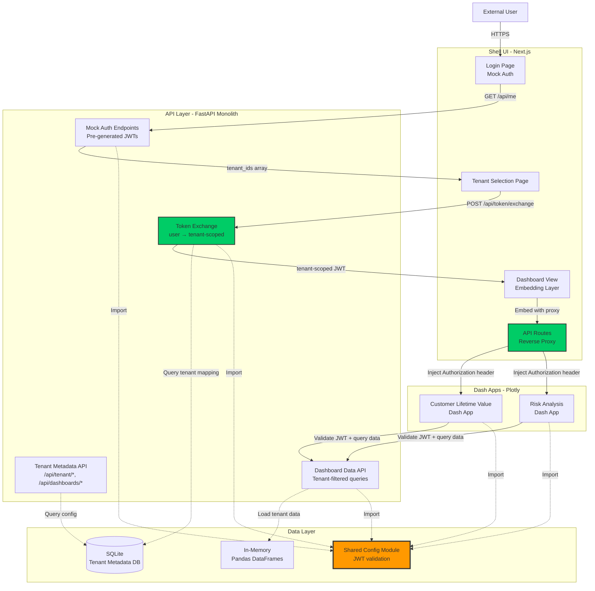
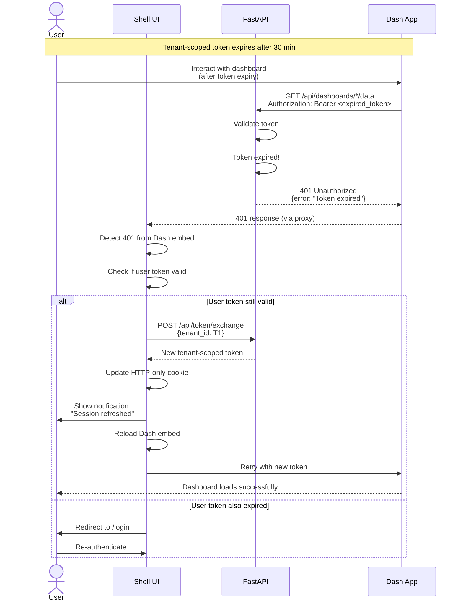
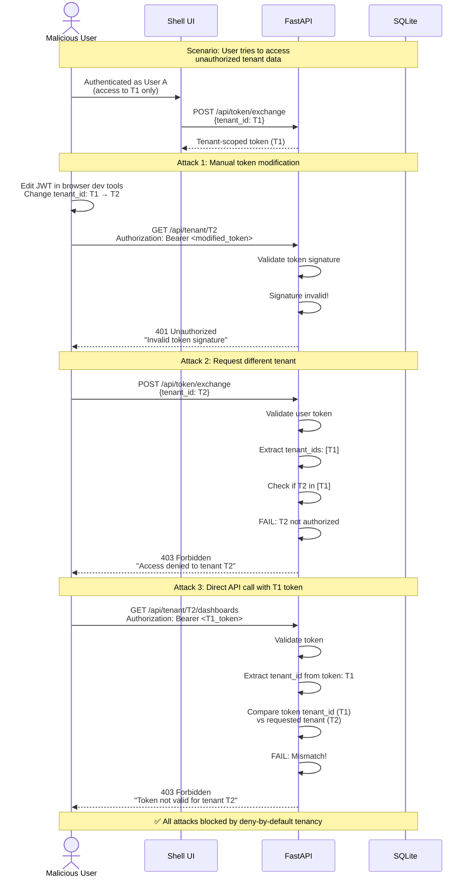

# Kyros Multi-Tenant SaaS PoC - Fullstack Architecture Document

**Version:** 0.1
**Date:** 2025-10-05
**Author:** Winston (Architect Agent)

---

## Table of Contents

1. [Introduction](#1-introduction)
2. [High Level Architecture](#2-high-level-architecture)
3. [Tech Stack](#3-tech-stack)
4. [Data Models](#4-data-models)
5. [API Specification](#5-api-specification)
6. [Components](#6-components)
7. [Core Workflows](#7-core-workflows)
8. [Database Schema](#8-database-schema)
9. [Frontend Architecture](#9-frontend-architecture)
10. [Backend Architecture](#10-backend-architecture)
11. [Unified Project Structure](#11-unified-project-structure)
12. [Development Workflow](#12-development-workflow)
13. [Deployment Architecture](#13-deployment-architecture)
14. [Security and Performance](#14-security-and-performance)
15. [Testing Strategy](#15-testing-strategy)
16. [Coding Standards](#16-coding-standards)
17. [Error Handling Strategy](#17-error-handling-strategy)
18. [Monitoring and Observability](#18-monitoring-and-observability)

---

## 1. Introduction

This document outlines the complete fullstack architecture for **Kyros Multi-Tenant SaaS PoC**, including backend systems, frontend implementation, and their integration. It serves as the single source of truth for AI-driven development, ensuring consistency across the entire technology stack.

This unified approach combines what would traditionally be separate backend and frontend architecture documents, streamlining the development process for modern fullstack applications where these concerns are increasingly intertwined.

**Purpose of this PoC:**
Validate the proposed multi-tenant architecture by implementing core mechanisms: shell-ui application with mocked authentication, JWT creation and token exchange for tenant isolation, tenant selection UI, and secure embedding of Plotly applications with tenant-scoped data access.

### 1.1 Starter Template or Existing Project

**Status:** Existing Architecture + PoC Simplifications

This PoC is based on **existing architecture documentation** found in `existing-architecture-docs/`, which defines a production-ready multi-tenant SaaS platform. The PoC will validate core architectural patterns while making strategic simplifications:

**Architectural Fidelity Maintained:**
- JWT token exchange mechanism for tenant isolation
- FastAPI monolith as API gateway and data access layer
- Next.js Shell UI with reverse proxy for Dash embedding
- Tenant metadata database for configuration
- Hard tenant isolation (non-negotiable)

**PoC Simplifications (documented for MVP separation):**
- Mock authentication instead of Azure AD B2C
- Pre-generated JWTs instead of cryptographic signing
- SQLite instead of PostgreSQL
- In-memory data sources (Pandas) instead of Azure Storage/Databricks
- Combined FastAPI service (auth + data) instead of separation
- No observability stack (Prometheus/Grafana/Loki)

**Constraints from Existing Architecture:**
- Must demonstrate token exchange flow (user token → tenant-scoped token)
- Must use reverse proxy with header injection for Dash embedding
- Must validate tenant isolation through JWT claims
- Must provide shared configuration module for JWT validation consistency

### 1.2 Change Log

| Date | Version | Description | Author |
|------|---------|-------------|--------|
| 2025-10-05 | 0.1 | Initial PoC architecture based on brainstorming session | Winston (Architect Agent) |

---

## 2. High Level Architecture

### 2.1 Technical Summary

The Kyros SaaS PoC implements a **multi-tenant web application architecture** with hard tenant isolation enforced through JWT token exchange. The system uses a **Next.js Shell UI** as the authenticated entry point, a **FastAPI monolith** for token exchange and tenant-scoped data access, and **embedded Plotly Dash applications** for data visualization. The architecture validates the production pattern through **reverse proxy header injection** where tenant-scoped JWTs are passed to Dash apps without client-side exposure.

The PoC runs entirely **locally** using Docker Compose, with mock authentication, SQLite for tenant metadata, and in-memory Pandas DataFrames for dashboard data. The token exchange mechanism—converting a user access token (with multiple `tenant_ids`) into a short-lived tenant-scoped token (single `tenant_id`)—is the central architectural validation point. A **shared configuration module** ensures JWT validation consistency across FastAPI and Dash services, addressing the configuration drift risk identified in brainstorming.

This architecture achieves the PRD's core goal: **prove that tenant isolation works through JWT claims** while maintaining production-realistic patterns (token exchange, reverse proxy, tenant metadata resolution) that can transition directly to MVP with infrastructure substitutions.

### 2.2 Platform and Infrastructure Choice

**Platform:** Local Development (Docker Compose)
**Key Services:**
- **Next.js (v14)** - Shell UI with API routes for reverse proxy
- **FastAPI (v0.115)** - Monolith handling auth mock, token exchange, and data APIs
- **Plotly Dash (v2.18)** - Two sample dashboard applications
- **SQLite** - Tenant metadata database
- **Python** - Pandas DataFrames for in-memory tenant data

**Deployment Host and Regions:** Local development environment only (no cloud deployment for PoC)

**Rationale:** The brainstorming session emphasized "architectural fidelity with pragmatic mocking." Docker Compose provides consistent local execution while avoiding cloud infrastructure costs and complexity. This choice allows rapid iteration on the token exchange mechanism—the core validation target—without dealing with cloud IAM, networking, or deployment pipelines.

**Production Path:** The MVP will migrate to **Azure** (Azure AD B2C, Azure Database for PostgreSQL, Azure Storage, App Service/AKS) as documented in existing architecture, but the PoC proves the patterns work before incurring infrastructure costs.

### 2.3 Repository Structure

**Structure:** Monorepo
**Monorepo Tool:** npm workspaces (lightweight, no additional tooling required)
**Package Organization:**

```
kyros-saas-poc/
├── apps/
│   ├── shell-ui/          # Next.js frontend
│   ├── api/               # FastAPI monolith
│   ├── dash-app-clv/      # Customer Lifetime Value dashboard
│   └── dash-app-risk/     # Risk Analysis dashboard
├── packages/
│   └── shared-config/     # Shared JWT config, constants, types
├── data/
│   └── mock-data/         # CSV/Parquet files for in-memory loading
├── docs/                  # Architecture, PRD, brainstorming results
└── docker-compose.yml     # Orchestration
```

**Rationale:**
- **Monorepo** enables sharing the critical configuration module between FastAPI and Dash apps (solves the "root cause" from Five Whys analysis)
- **npm workspaces** is sufficient for this PoC scale without Nx/Turborepo complexity
- **Separate Dash apps** demonstrate multi-dashboard capability and token passing to different embedded applications
- **Shared config package** is the lynchpin—ensures JWT secret, algorithm, and validation logic are identical across all services

### 2.4 High Level Architecture Diagram



### 2.5 Architectural Patterns

- **Token Exchange Pattern:** User authentication returns multi-tenant access token; explicit tenant selection triggers exchange to short-lived, single-tenant token - _Rationale:_ Enforces hard tenant isolation by ensuring embedded apps can only access one tenant's data per session; prevents confused deputy attacks

- **Backend For Frontend (BFF) via Next.js API Routes:** Shell UI uses Next.js API routes as reverse proxy with header injection - _Rationale:_ Keeps tenant-scoped JWT in server-side context (never exposed to browser), enables header injection for Dash embedding, validates production-realistic pattern

- **Shared Configuration Module:** Python package with JWT validation settings imported by all services - _Rationale:_ Solves root cause identified in Five Whys (configuration inconsistency); prevents signature validation failures from mismatched secrets/algorithms

- **Mock-Driven Development:** Mock external dependencies (auth, cloud storage, observability) while keeping internal patterns production-realistic - _Rationale:_ Focuses validation on architectural mechanisms (token exchange, tenant isolation) rather than infrastructure integration

- **Deny-by-Default Tenancy:** Every API request validates tenant_id from JWT claims; client never supplies tenant context - _Rationale:_ Security-first design prevents tenant enumeration and unauthorized cross-tenant access

- **Repository Pattern (Data Access Layer):** FastAPI DAL maps (tenant_id, dashboard_slug) to safe data queries - _Rationale:_ Centralizes tenant-scoped data access logic, makes it easy to swap in-memory sources for Azure Storage in MVP

---

## 3. Tech Stack

| Category | Technology | Version | Purpose | Rationale |
|----------|-----------|---------|---------|-----------|
| **Frontend Language** | TypeScript | 5.3+ | Type-safe Shell UI development | Prevents runtime errors in token handling; enables shared types with backend via shared-config package |
| **Frontend Framework** | Next.js | 14.2+ | Shell UI with SSR, API routes | Built-in API routes enable reverse proxy pattern; App Router provides modern routing; server components reduce client JS |
| **UI Component Library** | Tailwind CSS + Headless UI | Tailwind 3.4+, Headless UI 2.1+ | Styling and accessible components | Rapid UI development with utility-first CSS; Headless UI provides accessible primitives for tenant selector and modals |
| **State Management** | React Context + zustand | zustand 4.5+ | Client-side state (active tenant, user) | Lightweight for PoC scale; zustand handles tenant context persistence across navigation; Context for auth state |
| **Backend Language** | Python | 3.11+ | FastAPI and Dash applications | Unified language across API and Dash apps; strong data science ecosystem (Pandas) for mock data handling |
| **Backend Framework** | FastAPI | 0.115+ | API monolith (auth, token exchange, data) | Async performance; automatic OpenAPI docs; Pydantic validation; native async DB drivers for future PostgreSQL migration |
| **API Style** | REST | OpenAPI 3.0 | HTTP JSON APIs consumed by Shell UI and Dash | Simplest for PoC; well-understood; easy to test; matches existing architecture documentation |
| **Database** | SQLite | 3.45+ | Tenant metadata storage | Zero-config for PoC; schema designed for PostgreSQL compatibility (standard SQL, UUIDs as TEXT, JSONB as TEXT) |
| **Cache** | In-Memory (Python dict) | - | Tenant metadata caching in FastAPI | Simplest solution for PoC; no external cache server needed; sufficient for local single-instance deployment |
| **File Storage** | Local Filesystem (Pandas) | - | Mock tenant data (CSV/Parquet → DataFrames) | In-memory DataFrames loaded at startup; simulates Azure Storage without infrastructure; easy to inspect/modify test data |
| **Authentication** | Mock FastAPI Endpoints | - | Simulated user login and JWT issuance | Pre-generated JWTs stored as constants; validates token exchange flow without OIDC complexity; documented as PoC-only |
| **Frontend Testing** | Vitest + React Testing Library | Vitest 1.6+, RTL 16+ | Shell UI component and hook tests | Fast Vite-native test runner; RTL for user-centric testing; tests tenant selector and token refresh logic |
| **Backend Testing** | pytest + httpx | pytest 8.3+, httpx 0.27+ | FastAPI endpoint and token exchange tests | Async test client; validates JWT generation, tenant mapping, and data filtering logic |
| **E2E Testing** | Playwright | 1.47+ | Full flow: login → tenant select → dashboard embed | Tests the critical path identified in brainstorming; validates reverse proxy header injection and Dash rendering |
| **Build Tool** | npm/pip | npm 10+, pip 24+ | Package management | Standard tools; npm for frontend monorepo, pip for Python dependencies |
| **Bundler** | Vite (via Next.js) | - | Next.js handles bundling | Modern fast bundler built into Next.js 14; Turbopack available for faster dev builds |
| **IaC Tool** | Docker Compose | 2.29+ | Local orchestration | Defines Shell UI, FastAPI, and Dash services with networking; enables one-command startup and reset |
| **CI/CD** | None (PoC) | - | Manual testing locally | PoC does not require CI/CD; GitHub Actions can be added in MVP for automated testing and deployment |
| **Monitoring** | None (PoC) | - | Out of scope per brainstorming | Observability eliminated in SCAMPER analysis; logging to stdout only; MVP will add Prometheus/Grafana/Loki |
| **Logging** | Python logging + console | - | Stdout logging for debugging | Structured JSON logs in FastAPI/Dash; visible in Docker Compose logs; sufficient for PoC validation |
| **CSS Framework** | Tailwind CSS | 3.4+ | Utility-first styling | Rapid prototyping; small bundle size; consistent design system; integrates well with Next.js and Headless UI |

---

## 4. Data Models

Based on the existing architecture documentation and brainstorming session, the PoC requires data models for tenant metadata, user-tenant relationships, dashboard assignments, and mock tenant data. These models are shared between TypeScript (Shell UI) and Python (FastAPI/Dash) via the shared-config package.

### 4.1 Tenant

**Purpose:** Represents a client organization with isolated data access, configuration, and dashboard assignments.

**Key Attributes:**
- `id`: string (UUID) - **Internal identifier, never exposed in URLs**
- `name`: string - Display name (e.g., "Acme Corporation")
- `slug`: string - **⚠️ PoC ONLY: Used in URLs for routing** - URL-safe identifier (e.g., "acme-corp")
- `is_active`: boolean - Soft disable flag for tenant
- `config_json`: object - Flexible JSONB for branding, feature flags, display settings
- `created_at`: datetime - Timestamp of tenant creation

**⚠️ MVP MIGRATION REQUIREMENT:**
The `slug` is currently exposed in URLs (`/tenant/{tenant_slug}/dashboard/{dashboard_slug}`). In MVP, implement one of these patterns:
1. **Opaque Tokens:** Generate short-lived encrypted tokens that map to tenant IDs server-side
2. **Signed References:** Use HMAC-signed slugs that can be verified but not forged
3. **Session-Based Routing:** Store active tenant in server session, use routes without tenant identifiers

The PoC uses slugs in URLs for demo clarity, but production should never expose predictable identifiers that could enable enumeration or information disclosure.

**TypeScript Interface:**

```typescript
interface Tenant {
  id: string; // UUID - INTERNAL ONLY, never in URLs/responses
  name: string;
  slug: string; // ⚠️ PoC: Exposed in URLs - MVP must use opaque references
  is_active: boolean;
  config_json: {
    branding?: {
      logo_url?: string;
      primary_color?: string;
    };
    features?: {
      show_experimental?: boolean;
    };
  };
  created_at: string; // ISO 8601
}
```

**Relationships:**
- One tenant has many `UserTenant` mappings (users with access)
- One tenant has many `TenantDashboard` assignments (available dashboards)
- One tenant has zero or one `TenantDatastore` (mock data source mapping)

### 4.2 User

**Purpose:** Represents an authenticated user who may have access to one or more tenants.

**Key Attributes:**
- `user_id`: string (UUID) - Subject identifier from JWT (`sub`)
- `email`: string - User email address
- `created_at`: datetime - Timestamp of user creation

**TypeScript Interface:**

```typescript
interface User {
  user_id: string; // UUID, matches JWT 'sub'
  email: string;
  created_at: string; // ISO 8601
}
```

**Relationships:**
- One user has many `UserTenant` mappings (tenants they can access)

### 4.3 UserTenant

**Purpose:** Junction table establishing user access to specific tenants with role assignments.

**Key Attributes:**
- `user_id`: string (UUID) - Foreign key to User
- `tenant_id`: string (UUID) - Foreign key to Tenant
- `role`: string - Access level: "admin" or "viewer"

**TypeScript Interface:**

```typescript
interface UserTenant {
  user_id: string; // UUID
  tenant_id: string; // UUID
  role: 'admin' | 'viewer';
}
```

**Relationships:**
- Belongs to one User
- Belongs to one Tenant
- Composite primary key: (user_id, tenant_id)

### 4.4 Dashboard

**Purpose:** Defines a reusable dashboard template that can be assigned to tenants.

**Key Attributes:**
- `slug`: string - **⚠️ PoC ONLY: Used as primary key for simplicity**
- `title`: string - Display name (e.g., "Customer Lifetime Value")
- `description`: string - Optional description for dashboard listing
- `config_json`: object - Dashboard-specific configuration (layout, thresholds, labels)

**⚠️ MVP MIGRATION REQUIREMENT:**
In production architecture, add a separate `id: UUID` primary key. Never expose database primary keys (whether integer IDs or UUIDs) in URLs or API responses. The `slug` field should remain as a unique indexed column for lookups, but routing should use opaque tokens or encrypted references that map to internal IDs. This prevents enumeration attacks and decouples URLs from database structure.

**PoC Rationale:** Using slug as PK simplifies routing for demonstration purposes (`/tenant/{tenant_slug}/dashboard/{dashboard_slug}`), but this pattern must not continue to MVP.

**TypeScript Interface:**

```typescript
interface Dashboard {
  slug: string; // ⚠️ PoC: Primary key - DO NOT use in MVP
  // MVP TODO: Add id: string (UUID) as PK, make slug a unique indexed field
  title: string;
  description?: string;
  config_json: {
    layout?: 'single' | 'grid';
    thresholds?: Record<string, number>;
    labels?: Record<string, string>;
  };
}
```

**Relationships:**
- One dashboard has many `TenantDashboard` assignments (which tenants can view it)

### 4.5 TenantDashboard

**Purpose:** Junction table assigning dashboards to specific tenants.

**Key Attributes:**
- `tenant_id`: string (UUID) - Foreign key to Tenant
- `slug`: string - Foreign key to Dashboard

**TypeScript Interface:**

```typescript
interface TenantDashboard {
  tenant_id: string; // UUID
  slug: string; // Dashboard slug
}
```

**Relationships:**
- Belongs to one Tenant
- Belongs to one Dashboard
- Composite primary key: (tenant_id, slug)

### 4.6 JWT Token Claims

**Purpose:** Defines the structure of JWTs used in token exchange and validation.

**Key Attributes:**

**User Access Token (multi-tenant):**
- `sub`: string (UUID) - User identifier
- `email`: string - User email
- `tenant_ids`: string[] - Array of tenant UUIDs the user can access
- `iat`: number - Issued at timestamp
- `exp`: number - Expiration timestamp

**Tenant-Scoped Token (single tenant):**
- `sub`: string (UUID) - User identifier
- `email`: string - User email
- `tenant_id`: string (UUID) - Single active tenant
- `role`: string - User's role for this tenant ("admin" or "viewer")
- `iat`: number - Issued at timestamp
- `exp`: number - Expiration timestamp (short-lived: 15-30 min)

**TypeScript Interfaces:**

```typescript
interface UserAccessToken {
  sub: string; // UUID
  email: string;
  tenant_ids: string[]; // Array of tenant UUIDs
  iat: number; // Unix timestamp
  exp: number; // Unix timestamp
}

interface TenantScopedToken {
  sub: string; // UUID
  email: string;
  tenant_id: string; // Single tenant UUID
  role: 'admin' | 'viewer';
  iat: number; // Unix timestamp
  exp: number; // Unix timestamp (short-lived)
}
```

**Relationships:**
- User Access Token is issued by mock auth endpoint
- Tenant-Scoped Token is issued by token exchange endpoint after validating UserTenant mapping

### 4.7 Mock Tenant Data

**Purpose:** In-memory data structures representing tenant-specific datasets for dashboard visualization.

**Key Attributes:**
- `tenant_id`: string (UUID) - Tenant this data belongs to
- `dashboard_slug`: string - Which dashboard uses this data
- `data`: object - Pandas DataFrame serialized to JSON (records format)

**TypeScript Interface:**

```typescript
interface TenantDataRecord {
  [key: string]: string | number | boolean | null; // Flexible schema per dashboard
}

interface TenantData {
  tenant_id: string; // UUID
  dashboard_slug: string;
  data: TenantDataRecord[];
}
```

**Relationships:**
- Associated with one Tenant (but not a DB foreign key; matched in-memory)
- Associated with one Dashboard (by slug)

### 4.8 PoC vs MVP Data Model Tradeoffs

**⚠️ CRITICAL SECURITY MIGRATION NOTES:**

| PoC Pattern | MVP Requirement | Security Risk if Not Changed |
|-------------|-----------------|------------------------------|
| Slug used as Dashboard PK | Add UUID `id` field as PK; slug becomes unique indexed column | Exposes database structure; enables enumeration; couples URLs to DB schema |
| Tenant slug in URLs (`/tenant/acme-corp/dashboard/...`) | Use opaque tokens, signed references, or session-based routing | Predictable URLs enable tenant enumeration; leaks business relationships |
| User IDs (UUIDs) in JWT claims exposed to client | Keep UUIDs internal; use opaque session tokens client-side | UUIDs are predictable and may leak system information |

**PoC Justification:**
These patterns simplify demonstration and reduce complexity for validating the token exchange mechanism. However, **all URL-exposed identifiers represent security risks in production** and must be replaced with non-enumerable, non-predictable references.

**MVP Implementation Guidance:**
1. Add surrogate UUID primary keys to all tables where slug is currently PK
2. Create unique indexes on slug fields for fast lookups
3. Implement URL token generation service (encrypt/sign tenant+dashboard references)
4. Update all routing to use opaque tokens instead of slugs
5. Add security tests that verify primary keys never appear in HTTP responses or URLs

---

## 5. API Specification

The FastAPI monolith exposes REST endpoints for mock authentication, token exchange, tenant metadata, and dashboard data access. All endpoints except mock auth require Bearer token authentication.

### REST API Specification

```yaml
openapi: 3.0.0
info:
  title: Kyros SaaS PoC API
  version: 0.1.0
  description: |
    FastAPI monolith providing mock authentication, JWT token exchange,
    tenant metadata, and tenant-scoped dashboard data access.

    ⚠️ PoC Simplifications:
    - Mock auth endpoints return pre-generated JWTs (not production OIDC)
    - Combined auth and data services (MVP should separate these)
    - No rate limiting or advanced security headers

servers:
  - url: http://localhost:8000
    description: Local development (Docker Compose)

components:
  securitySchemes:
    BearerAuth:
      type: http
      scheme: bearer
      bearerFormat: JWT
      description: |
        JWT token in Authorization header.
        - User Access Token: Contains tenant_ids array
        - Tenant-Scoped Token: Contains single tenant_id

  schemas:
    Error:
      type: object
      properties:
        error:
          type: object
          properties:
            code:
              type: string
            message:
              type: string
            details:
              type: object
            timestamp:
              type: string
              format: date-time
            request_id:
              type: string

paths:
  /api/auth/mock-login:
    post:
      summary: Mock login endpoint (PoC only)
      description: |
        Returns a pre-generated user access token for testing.
        ⚠️ NOT FOR PRODUCTION - Replace with Azure AD B2C OIDC flow in MVP.
      tags:
        - Mock Auth
      requestBody:
        required: true
        content:
          application/json:
            schema:
              type: object
              properties:
                email:
                  type: string
                  format: email
                  example: "analyst@acme.com"
      responses:
        '200':
          description: User access token issued
          content:
            application/json:
              schema:
                type: object
                properties:
                  access_token:
                    type: string
                  token_type:
                    type: string
                    enum: [Bearer]
                  expires_in:
                    type: integer
        '404':
          description: User not found in mock data
          content:
            application/json:
              schema:
                $ref: '#/components/schemas/Error'

  /api/me:
    get:
      summary: Get current user info and accessible tenants
      description: |
        Returns user profile and list of tenants they have access to.
        Requires user access token.
      tags:
        - User
      security:
        - BearerAuth: []
      responses:
        '200':
          description: User info with tenant list
        '401':
          description: Invalid or expired token
          content:
            application/json:
              schema:
                $ref: '#/components/schemas/Error'

  /api/token/exchange:
    post:
      summary: Exchange user token for tenant-scoped token
      description: |
        Validates user has access to requested tenant and issues a
        short-lived tenant-scoped JWT (15-30 min lifetime).
        This is the core architectural mechanism being validated in the PoC.
      tags:
        - Token Exchange
      security:
        - BearerAuth: []
      requestBody:
        required: true
        content:
          application/json:
            schema:
              type: object
              required:
                - tenant_id
              properties:
                tenant_id:
                  type: string
                  format: uuid
      responses:
        '200':
          description: Tenant-scoped token issued
          content:
            application/json:
              schema:
                type: object
                properties:
                  access_token:
                    type: string
                    description: Tenant-scoped JWT
                  token_type:
                    type: string
                    enum: [Bearer]
                  expires_in:
                    type: integer
                    description: Token lifetime in seconds
        '400':
          description: Invalid request (missing tenant_id)
        '401':
          description: Invalid or expired user token
        '403':
          description: User does not have access to requested tenant
          content:
            application/json:
              schema:
                $ref: '#/components/schemas/Error'

  /api/tenant/{tenant_id}:
    get:
      summary: Get tenant metadata
      description: |
        Returns tenant configuration including branding and feature flags.
        Requires tenant-scoped token with matching tenant_id.
      tags:
        - Tenant
      security:
        - BearerAuth: []
      parameters:
        - name: tenant_id
          in: path
          required: true
          schema:
            type: string
            format: uuid
      responses:
        '200':
          description: Tenant metadata
        '401':
          description: Invalid or expired token
        '403':
          description: Token tenant_id does not match requested tenant
        '404':
          description: Tenant not found

  /api/tenant/{tenant_id}/dashboards:
    get:
      summary: List dashboards assigned to tenant
      description: |
        Returns array of dashboards the tenant has access to.
        Requires tenant-scoped token with matching tenant_id.
      tags:
        - Dashboards
      security:
        - BearerAuth: []
      parameters:
        - name: tenant_id
          in: path
          required: true
          schema:
            type: string
            format: uuid
      responses:
        '200':
          description: List of tenant's dashboards
        '401':
          description: Invalid or expired token
        '403':
          description: Token tenant_id does not match requested tenant

  /api/dashboards/{slug}/data:
    get:
      summary: Get dashboard data for active tenant
      description: |
        Returns tenant-filtered data for the specified dashboard.
        Tenant context extracted from JWT tenant_id claim.
        Data is loaded from in-memory Pandas DataFrames (PoC) or
        queried from tenant-scoped storage (MVP).
      tags:
        - Dashboard Data
      security:
        - BearerAuth: []
      parameters:
        - name: slug
          in: path
          required: true
          schema:
            type: string
          example: "customer-lifetime-value"
        - name: filters
          in: query
          required: false
          schema:
            type: object
          description: Optional filters (JSON object)
      responses:
        '200':
          description: Tenant-scoped dashboard data
        '401':
          description: Invalid or expired token
        '403':
          description: Tenant does not have access to this dashboard
        '404':
          description: Dashboard not found or no data available

  /health:
    get:
      summary: Health check endpoint
      description: Returns service health status
      tags:
        - System
      responses:
        '200':
          description: Service is healthy
          content:
            application/json:
              schema:
                type: object
                properties:
                  status:
                    type: string
                    enum: [ok]
                  timestamp:
                    type: string
                    format: date-time
```

---

## 6. Components

This section defines the major logical components across the fullstack PoC, their responsibilities, interfaces, dependencies, and technology implementation.

### 6.1 Shell UI (Next.js Application)

**Responsibility:** Authenticated entry point providing login, tenant selection, dashboard listing, and secure embedding of Dash applications via reverse proxy.

**Key Interfaces:**
- **Pages:**
  - `/login` - Mock authentication interface
  - `/` - Tenant selector (if multi-tenant user) or redirect to dashboard list
  - `/tenant/[tenant_slug]` - Dashboard listing page
  - `/tenant/[tenant_slug]/dashboard/[dashboard_slug]` - Dashboard embedding page

- **API Routes (BFF Pattern):**
  - `/api/proxy/dash/[...path]` - Reverse proxy with Authorization header injection

**Dependencies:**
- FastAPI Mock Auth endpoints (`/api/auth/mock-login`, `/api/me`)
- FastAPI Token Exchange endpoint (`/api/token/exchange`)
- FastAPI Metadata endpoints (`/api/tenant/{id}`, `/api/tenant/{id}/dashboards`)
- Shared Config Module (for JWT secret to verify tokens client-side if needed)

**Technology Stack:**
- Next.js 14.2+ (App Router)
- TypeScript 5.3+
- Tailwind CSS + Headless UI (components)
- zustand (tenant context state)
- React Context (auth state)

**Key Design Patterns:**
- **Server Components** for initial page loads (fetch tenant list server-side)
- **Client Components** for interactive tenant selector and token refresh logic
- **API Routes as Reverse Proxy** to inject tenant-scoped JWT into Dash requests
- **HTTP-Only Cookies** for storing tenant-scoped token (never in localStorage)

### 6.2 FastAPI Monolith

**Responsibility:** Central API gateway handling mock authentication, JWT token exchange, tenant metadata resolution, and tenant-scoped data access for Dash applications.

**Key Interfaces:**
- **Mock Auth API:**
  - `POST /api/auth/mock-login` - Returns user access token

- **User API:**
  - `GET /api/me` - Returns user info and accessible tenants

- **Token Exchange API:**
  - `POST /api/token/exchange` - Issues tenant-scoped token

- **Tenant Metadata API:**
  - `GET /api/tenant/{tenant_id}` - Returns tenant config
  - `GET /api/tenant/{tenant_id}/dashboards` - Returns dashboard assignments

- **Dashboard Data API:**
  - `GET /api/dashboards/{slug}/data` - Returns tenant-filtered dashboard data

**Dependencies:**
- SQLite Tenant Metadata DB (via `aiosqlite`)
- In-Memory Data Store (Pandas DataFrames loaded at startup)
- Shared Config Module (JWT validation settings)

**Technology Stack:**
- Python 3.11+
- FastAPI 0.115+
- Pydantic v2 (request/response validation)
- PyJWT or python-jose (JWT encoding/decoding)
- aiosqlite (async SQLite access)
- Pandas (in-memory data loading)

**Key Design Patterns:**
- **Dependency Injection** for database connections and JWT validator
- **Middleware** for JWT validation and tenant context extraction
- **Repository Pattern** (Data Access Layer) for tenant-scoped queries
- **Deny-by-Default Tenancy** - All endpoints validate tenant_id from JWT claims

### 6.3 Dash App: Customer Lifetime Value (CLV)

**Responsibility:** Embedded Plotly Dash application visualizing customer lifetime value metrics for the active tenant.

**Key Interfaces:**
- **Entry Point:** `/dash/customer-lifetime-value/`
- **Callbacks:** Interactive filters triggering data refresh via FastAPI data API
- **Token Handling:** Extracts and validates tenant-scoped JWT from Authorization header

**Dependencies:**
- FastAPI Dashboard Data API (`/api/dashboards/customer-lifetime-value/data`)
- Shared Config Module (JWT validation)

**Technology Stack:**
- Python 3.11+
- Plotly Dash 2.18+
- Dash Bootstrap Components (UI)
- Pandas (data manipulation)
- PyJWT or python-jose (JWT validation)

**Key Design Patterns:**
- **Request-Scoped Context** - JWT decoded per request, tenant_id stored in thread-local or request context
- **Server-Side Callbacks** - All data fetching happens server-side with tenant context
- **No Direct Storage Access** - All data retrieved via FastAPI API (validates token exchange pattern)

### 6.4 Dash App: Risk Analysis

**Responsibility:** Embedded Plotly Dash application visualizing risk analysis metrics for the active tenant.

**Key Interfaces:**
- **Entry Point:** `/dash/risk-analysis/`
- **Callbacks:** Interactive filters triggering data refresh via FastAPI data API
- **Token Handling:** Extracts and validates tenant-scoped JWT from Authorization header

**Dependencies:**
- FastAPI Dashboard Data API (`/api/dashboards/risk-analysis/data`)
- Shared Config Module (JWT validation)

**Technology Stack:**
- Python 3.11+
- Plotly Dash 2.18+
- Dash Bootstrap Components (UI)
- Pandas (data manipulation)
- PyJWT or python-jose (JWT validation)

**Key Design Patterns:**
- Same as CLV Dash App (shared architecture pattern)

### 6.5 Shared Config Module

**Responsibility:** Provides consistent JWT validation settings, constants, and type definitions across all services (FastAPI and Dash apps).

**Key Interfaces:**
- **JWT Configuration:**
  - `JWT_SECRET_KEY` - Shared secret for HMAC signing
  - `JWT_ALGORITHM` - "HS256"
  - `JWT_ISSUER` - "kyros-poc"
  - `USER_TOKEN_EXPIRY` - 3600 seconds (1 hour)
  - `TENANT_TOKEN_EXPIRY` - 1800 seconds (30 minutes)

- **Validation Functions:**
  - `validate_user_token(token: str) -> UserAccessToken`
  - `validate_tenant_token(token: str) -> TenantScopedToken`

- **Mock Data:**
  - `MOCK_USERS` - Pre-defined user records
  - `PRE_GENERATED_TOKENS` - Mock JWTs for testing

**Dependencies:**
- None (pure configuration and utility functions)

**Technology Stack:**
- Python 3.11+ (shared package)
- PyJWT or python-jose (JWT operations)
- Pydantic (data models for token claims)

**Key Design Patterns:**
- **Single Source of Truth** for JWT configuration (solves root cause from brainstorming)
- **Immutable Configuration** - Settings loaded once at startup, never modified
- **Type-Safe Exports** - Pydantic models for all token claim structures

### 6.6 Tenant Metadata Database (SQLite)

**Responsibility:** Stores tenant configuration, user-tenant mappings, dashboard assignments, and provides fast lookups for authorization and metadata resolution.

**Key Interfaces:**
- **Tables:**
  - `tenants` - Tenant records
  - `users` - User records
  - `user_tenants` - User-tenant access mappings
  - `dashboards` - Dashboard definitions
  - `tenant_dashboards` - Dashboard assignments

**Dependencies:**
- None (standalone SQLite file)

**Technology Stack:**
- SQLite 3.45+
- Schema designed for PostgreSQL compatibility (standard SQL)

**Key Design Patterns:**
- **Seed Scripts** for initial data population (automated setup)
- **Validation Scripts** to verify data integrity before demos
- **Transaction Isolation** for consistent reads

### 6.7 In-Memory Data Store (Pandas)

**Responsibility:** Loads mock tenant data from CSV/Parquet files into Pandas DataFrames at FastAPI startup, providing fast tenant-filtered queries.

**Key Interfaces:**
- **Data Loading:**
  - `load_tenant_data(tenant_id: str, dashboard_slug: str) -> pd.DataFrame`
  - `filter_data(df: pd.DataFrame, filters: dict) -> pd.DataFrame`

**Dependencies:**
- Local filesystem (`data/mock-data/` directory)

**Technology Stack:**
- Python Pandas
- CSV/Parquet file formats

**Key Design Patterns:**
- **Lazy Loading** - DataFrames loaded on first request per (tenant_id, dashboard_slug)
- **In-Memory Cache** - DataFrames kept in memory for duration of FastAPI process
- **Immutable Data** - Mock data never modified at runtime

---

## 7. Core Workflows

This section illustrates key user journeys and system interactions using sequence diagrams, focusing on the critical validation points identified in the brainstorming session.

### 7.1 Complete Authentication and Dashboard Access Flow

```mermaid
sequenceDiagram
    actor User
    participant Shell as Shell UI<br/>(Next.js)
    participant API as FastAPI<br/>Monolith
    participant DB as SQLite<br/>Metadata
    participant Dash as Dash App<br/>(CLV/Risk)
    participant Data as In-Memory<br/>Data Store

    Note over User,Data: 1. Mock Login
    User->>Shell: Navigate to /login
    Shell->>User: Show login form
    User->>Shell: Enter email
    Shell->>API: POST /api/auth/mock-login<br/>{email}
    API->>API: Lookup user in mock data
    API->>API: Generate user access token<br/>(tenant_ids: [T1, T2])
    API-->>Shell: {access_token, expires_in}
    Shell->>Shell: Store token in memory/cookie

    Note over User,Data: 2. Tenant Discovery
    Shell->>API: GET /api/me<br/>Authorization: Bearer <user_token>
    API->>API: Validate user token
    API->>DB: SELECT user_tenants<br/>WHERE user_id = sub
    DB-->>API: [{T1, "viewer"}, {T2, "admin"}]
    API->>DB: SELECT tenants<br/>WHERE id IN (T1, T2)
    DB-->>API: Tenant metadata
    API-->>Shell: {user_id, email, tenants: [...]}

    Note over User,Data: 3. Tenant Selection
    Shell->>User: Show tenant selector<br/>(Acme Corp, Beta Inc)
    User->>Shell: Select "Acme Corp" (T1)

    Note over User,Data: 4. Token Exchange
    Shell->>API: POST /api/token/exchange<br/>Authorization: Bearer <user_token><br/>{tenant_id: T1}
    API->>API: Validate user token
    API->>API: Extract tenant_ids from token
    API->>API: Verify T1 in tenant_ids
    API->>DB: SELECT user_tenants<br/>WHERE user_id=sub AND tenant_id=T1
    DB-->>API: {role: "viewer"}
    API->>API: Generate tenant-scoped token<br/>(tenant_id: T1, role: "viewer")<br/>Expiry: 30 min
    API-->>Shell: {access_token, expires_in: 1800}
    Shell->>Shell: Store tenant token in<br/>HTTP-only cookie

    Note over User,Data: 5. Dashboard Listing
    Shell->>API: GET /api/tenant/T1/dashboards<br/>Authorization: Bearer <tenant_token>
    API->>API: Validate tenant token
    API->>API: Extract tenant_id from token
    API->>API: Verify token tenant_id == T1
    API->>DB: SELECT td.slug, d.title, d.description<br/>FROM tenant_dashboards td<br/>JOIN dashboards d ON td.slug = d.slug<br/>WHERE td.tenant_id = T1
    DB-->>API: [{slug: "clv", title: "CLV"}, ...]
    API-->>Shell: Dashboard list
    Shell->>User: Show dashboard tiles

    Note over User,Data: 6. Dashboard Embedding
    User->>Shell: Click "Customer Lifetime Value"
    Shell->>Shell: Navigate to<br/>/tenant/acme-corp/dashboard/clv
    Shell->>User: Render page with iframe/embed
    User->>Shell: Browser loads embedded Dash app
    Shell->>Shell: API Route: /api/proxy/dash/clv
    Shell->>Shell: Inject Authorization header<br/>from HTTP-only cookie
    Shell->>Dash: GET /dash/clv/<br/>Authorization: Bearer <tenant_token>

    Note over User,Data: 7. Dash App Initialization
    Dash->>Dash: Validate tenant token<br/>(shared config module)
    Dash->>Dash: Extract tenant_id: T1
    Dash->>API: GET /api/dashboards/clv/data<br/>Authorization: Bearer <tenant_token>
    API->>API: Validate tenant token
    API->>API: Extract tenant_id from token
    API->>Data: load_tenant_data(T1, "clv")
    Data-->>API: Pandas DataFrame (T1 data only)
    API-->>Dash: {tenant_id: T1, data: [...]}
    Dash->>Dash: Render visualizations
    Dash-->>Shell: HTML response
    Shell-->>User: Display dashboard

    Note over User,Data: 8. User Interaction (Filter)
    User->>Dash: Change filter (e.g., date range)
    Dash->>API: GET /api/dashboards/clv/data?filters=...<br/>Authorization: Bearer <tenant_token>
    API->>API: Validate tenant token
    API->>Data: load_tenant_data(T1, "clv")<br/>+ apply filters
    Data-->>API: Filtered DataFrame
    API-->>Dash: {tenant_id: T1, data: [...]}
    Dash->>Dash: Update visualization
    Dash-->>User: Refreshed chart
```



### 7.2 Token Expiry and Refresh Flow



### 7.3 Cross-Tenant Isolation Validation



---

## 8. Database Schema

The tenant metadata database uses SQLite for the PoC but is designed for PostgreSQL compatibility. This schema aligns with the existing architecture documentation while incorporating PoC-specific simplifications.

### 8.1 Schema Definition (SQLite with PostgreSQL compatibility)

```sql
-- ============================================================================
-- Kyros SaaS PoC - Tenant Metadata Database Schema
-- SQLite implementation with PostgreSQL migration path
-- ============================================================================

-- Enable foreign key constraints (SQLite requires explicit enable)
PRAGMA foreign_keys = ON;

-- ----------------------------------------------------------------------------
-- TENANTS
-- Core tenant records with configuration
-- ----------------------------------------------------------------------------
CREATE TABLE tenants (
    id TEXT PRIMARY KEY,                    -- UUID stored as TEXT (PostgreSQL: UUID type)
    name TEXT NOT NULL,                     -- Display name
    slug TEXT NOT NULL UNIQUE,              -- ⚠️ PoC: Used in URLs (MVP: add opaque token layer)
    is_active INTEGER NOT NULL DEFAULT 1,   -- Boolean (SQLite uses INTEGER 0/1)
    config_json TEXT,                       -- JSONB in PostgreSQL, TEXT in SQLite
    created_at TEXT NOT NULL DEFAULT (datetime('now', 'utc'))  -- ISO 8601 timestamp
);

CREATE INDEX idx_tenants_slug ON tenants(slug);
CREATE INDEX idx_tenants_active ON tenants(is_active);

-- ----------------------------------------------------------------------------
-- USERS
-- Authenticated users (sub from JWT)
-- ----------------------------------------------------------------------------
CREATE TABLE users (
    user_id TEXT PRIMARY KEY,               -- UUID from JWT 'sub' claim
    email TEXT NOT NULL UNIQUE,             -- User email
    created_at TEXT NOT NULL DEFAULT (datetime('now', 'utc'))
);

CREATE INDEX idx_users_email ON users(email);

-- ----------------------------------------------------------------------------
-- USER_TENANTS
-- Junction table: which users can access which tenants and their roles
-- ----------------------------------------------------------------------------
CREATE TABLE user_tenants (
    user_id TEXT NOT NULL,
    tenant_id TEXT NOT NULL,
    role TEXT NOT NULL CHECK(role IN ('admin', 'viewer')),  -- Enum constraint
    PRIMARY KEY (user_id, tenant_id),
    FOREIGN KEY (user_id) REFERENCES users(user_id) ON DELETE CASCADE,
    FOREIGN KEY (tenant_id) REFERENCES tenants(id) ON DELETE CASCADE
);

CREATE INDEX idx_user_tenants_user ON user_tenants(user_id);
CREATE INDEX idx_user_tenants_tenant ON user_tenants(tenant_id);

-- ----------------------------------------------------------------------------
-- DASHBOARDS
-- Reusable dashboard definitions
-- ----------------------------------------------------------------------------
CREATE TABLE dashboards (
    slug TEXT PRIMARY KEY,                  -- ⚠️ PoC: PK for simplicity (MVP: add UUID id)
    title TEXT NOT NULL,
    description TEXT,
    config_json TEXT,                       -- Dashboard configuration
    created_at TEXT NOT NULL DEFAULT (datetime('now', 'utc'))
);

-- ----------------------------------------------------------------------------
-- TENANT_DASHBOARDS
-- Junction table: which dashboards are assigned to which tenants
-- ----------------------------------------------------------------------------
CREATE TABLE tenant_dashboards (
    tenant_id TEXT NOT NULL,
    slug TEXT NOT NULL,                     -- Dashboard slug
    PRIMARY KEY (tenant_id, slug),
    FOREIGN KEY (tenant_id) REFERENCES tenants(id) ON DELETE CASCADE,
    FOREIGN KEY (slug) REFERENCES dashboards(slug) ON DELETE CASCADE
);

CREATE INDEX idx_tenant_dashboards_tenant ON tenant_dashboards(tenant_id);
CREATE INDEX idx_tenant_dashboards_slug ON tenant_dashboards(slug);

-- ============================================================================
-- PoC SEED DATA
-- Mock tenants, users, and mappings for testing
-- ============================================================================

-- Two mock tenants
INSERT INTO tenants (id, name, slug, is_active, config_json) VALUES
(
    '8e1b3d5b-7c9a-4e2f-b1d3-a5c7e9f12345',
    'Acme Corporation',
    'acme-corp',
    1,
    '{"branding": {"logo_url": "/logos/acme.svg", "primary_color": "#0052cc"}, "features": {"show_experimental": false}}'
),
(
    '2450a2f8-3b7e-4eab-9b4a-1f73d9a0b1c4',
    'Beta Industries',
    'beta-ind',
    1,
    '{"branding": {"logo_url": "/logos/beta.svg", "primary_color": "#ff5722"}, "features": {"show_experimental": true}}'
);

-- Three mock users
INSERT INTO users (user_id, email) VALUES
('f8d1e2c3-4b5a-6789-abcd-ef1234567890', 'analyst@acme.com'),
('a1b2c3d4-e5f6-7890-abcd-ef1234567890', 'admin@acme.com'),
('b2c3d4e5-f6a7-8901-bcde-f12345678901', 'viewer@beta.com');

-- User-tenant mappings
-- User 1: Viewer access to Acme only
INSERT INTO user_tenants (user_id, tenant_id, role) VALUES
('f8d1e2c3-4b5a-6789-abcd-ef1234567890', '8e1b3d5b-7c9a-4e2f-b1d3-a5c7e9f12345', 'viewer');

-- User 2: Admin access to both Acme and Beta
INSERT INTO user_tenants (user_id, tenant_id, role) VALUES
('a1b2c3d4-e5f6-7890-abcd-ef1234567890', '8e1b3d5b-7c9a-4e2f-b1d3-a5c7e9f12345', 'admin'),
('a1b2c3d4-e5f6-7890-abcd-ef1234567890', '2450a2f8-3b7e-4eab-9b4a-1f73d9a0b1c4', 'admin');

-- User 3: Viewer access to Beta only
INSERT INTO user_tenants (user_id, tenant_id, role) VALUES
('b2c3d4e5-f6a7-8901-bcde-f12345678901', '2450a2f8-3b7e-4eab-9b4a-1f73d9a0b1c4', 'viewer');

-- Two dashboard definitions
INSERT INTO dashboards (slug, title, description, config_json) VALUES
(
    'customer-lifetime-value',
    'Customer Lifetime Value',
    'Analyze customer lifetime value metrics and segmentation',
    '{"layout": "grid", "thresholds": {"high": 15000, "medium": 8000}, "labels": {"currency": "USD"}}'
),
(
    'risk-analysis',
    'Risk Analysis',
    'Risk scoring and exposure analysis dashboards',
    '{"layout": "single", "thresholds": {"critical": 0.8, "warning": 0.5}, "labels": {"unit": "probability"}}'
);

-- Dashboard assignments
-- Acme has both dashboards
INSERT INTO tenant_dashboards (tenant_id, slug) VALUES
('8e1b3d5b-7c9a-4e2f-b1d3-a5c7e9f12345', 'customer-lifetime-value'),
('8e1b3d5b-7c9a-4e2f-b1d3-a5c7e9f12345', 'risk-analysis');

-- Beta has only risk-analysis
INSERT INTO tenant_dashboards (tenant_id, slug) VALUES
('2450a2f8-3b7e-4eab-9b4a-1f73d9a0b1c4', 'risk-analysis');
```

### 8.2 PostgreSQL Migration Notes

**Changes Required for MVP Migration:**

```sql
-- 1. Change UUID storage from TEXT to native UUID type
ALTER TABLE tenants ALTER COLUMN id TYPE UUID USING id::uuid;
ALTER TABLE users ALTER COLUMN user_id TYPE UUID USING user_id::uuid;
-- ... (repeat for all UUID columns)

-- 2. Change INTEGER booleans to native BOOLEAN
ALTER TABLE tenants ALTER COLUMN is_active TYPE BOOLEAN USING is_active::boolean;

-- 3. Change TEXT timestamps to TIMESTAMP WITH TIME ZONE
ALTER TABLE tenants ALTER COLUMN created_at TYPE TIMESTAMPTZ USING created_at::timestamptz;
-- ... (repeat for all timestamp columns)

-- 4. Change TEXT JSON to native JSONB
ALTER TABLE tenants ALTER COLUMN config_json TYPE JSONB USING config_json::jsonb;
-- ... (repeat for all JSON columns)

-- 5. Add GIN indexes for JSONB columns (performance)
CREATE INDEX idx_tenants_config_jsonb ON tenants USING GIN (config_json);
CREATE INDEX idx_dashboards_config_jsonb ON dashboards USING GIN (config_json);

-- 6. Enable Row-Level Security (RLS) for defense-in-depth
ALTER TABLE tenants ENABLE ROW LEVEL SECURITY;
ALTER TABLE user_tenants ENABLE ROW LEVEL SECURITY;
-- Create RLS policies per existing architecture guidance
```

---

## 9. Frontend Architecture

This section defines Next.js Shell UI implementation patterns, component organization, state management, and routing structure.

### 9.1 Component Architecture

#### Component Organization

```
apps/shell-ui/src/
├── app/                          # Next.js 14 App Router
│   ├── layout.tsx                # Root layout with providers
│   ├── page.tsx                  # Home (tenant selector or redirect)
│   ├── login/
│   │   └── page.tsx              # Mock login page
│   ├── tenant/
│   │   └── [tenant_slug]/
│   │       ├── page.tsx          # Dashboard listing
│   │       └── dashboard/
│   │           └── [dashboard_slug]/
│   │               └── page.tsx  # Dashboard embed view
│   └── api/
│       └── proxy/
│           └── dash/
│               └── [...path]/
│                   └── route.ts  # Reverse proxy API route
├── components/
│   ├── auth/
│   │   ├── LoginForm.tsx         # Mock login form
│   │   └── AuthGuard.tsx         # Protected route wrapper
│   ├── tenant/
│   │   ├── TenantSelector.tsx    # Tenant chooser component
│   │   └── TenantSwitcher.tsx    # Header tenant switch dropdown
│   ├── dashboard/
│   │   ├── DashboardCard.tsx     # Dashboard tile in listing
│   │   ├── DashboardEmbed.tsx    # Iframe/embed container
│   │   └── DashboardLoading.tsx  # Loading skeleton
│   ├── layout/
│   │   ├── Header.tsx            # App header with nav
│   │   ├── Footer.tsx            # App footer
│   │   └── ErrorBoundary.tsx     # Error boundary wrapper
│   └── ui/                       # Shared UI primitives (Headless UI wrappers)
│       ├── Button.tsx
│       ├── Card.tsx
│       └── Modal.tsx
├── hooks/
│   ├── useAuth.ts                # Auth state and login/logout
│   ├── useTenantContext.ts       # Active tenant state
│   ├── useTokenRefresh.ts        # Auto-refresh tenant token
│   └── useApi.ts                 # API client hook
├── lib/
│   ├── api-client.ts             # Fetch wrapper with auth
│   ├── token-storage.ts          # Token cookie helpers
│   └── types.ts                  # Shared TypeScript types
└── store/
    └── tenant-store.ts           # Zustand store for tenant context
```

### 9.2 State Management Architecture

#### State Structure

**Tenant Context (Zustand):** Persisted in localStorage; survives page refresh

**Auth State (React Context):** In-memory only; checked on app mount via `/api/me`

---

## 10. Backend Architecture

This section defines FastAPI service organization, middleware patterns, and authentication/authorization implementation.

### 10.1 Service Architecture (Monolith)

#### Function Organization

```
apps/api/src/
├── main.py                       # FastAPI app entry point
├── config/
│   ├── __init__.py
│   └── settings.py               # Environment configuration
├── middleware/
│   ├── __init__.py
│   ├── auth.py                   # JWT validation middleware
│   └── cors.py                   # CORS configuration
├── routers/
│   ├── __init__.py
│   ├── auth.py                   # Mock auth endpoints
│   ├── token.py                  # Token exchange endpoints
│   ├── tenant.py                 # Tenant metadata endpoints
│   └── dashboard.py              # Dashboard data endpoints
├── models/
│   ├── __init__.py
│   ├── tokens.py                 # Pydantic models for JWTs
│   ├── tenant.py                 # Tenant data models
│   └── dashboard.py              # Dashboard data models
├── services/
│   ├── __init__.py
│   ├── jwt_service.py            # JWT encoding/decoding/validation
│   ├── tenant_service.py         # Tenant metadata business logic
│   └── data_service.py           # Dashboard data loading (DAL)
├── database/
│   ├── __init__.py
│   ├── connection.py             # SQLite async connection
│   └── queries.py                # SQL query functions
└── data/
    ├── __init__.py
    ├── mock_users.py             # Pre-generated JWTs and mock user data
    └── data_loader.py            # In-memory Pandas DataFrame loader
```

---

## 11. Unified Project Structure

```
kyros-saas-poc/
├── .github/                           # CI/CD workflows (future)
├── apps/                              # Application packages
│   ├── shell-ui/                      # Next.js Shell UI
│   ├── api/                           # FastAPI Monolith
│   ├── dash-app-clv/                  # Customer Lifetime Value Dashboard
│   └── dash-app-risk/                 # Risk Analysis Dashboard
├── packages/                          # Shared packages
│   └── shared-config/                 # ⭐ Shared JWT config (Python)
├── data/                              # Data and database files
│   ├── tenant_metadata.db             # SQLite database (generated)
│   └── mock-data/                     # Mock tenant data (CSV/Parquet)
├── database/                          # Database schemas and migrations
│   ├── schema.sql                     # SQLite schema with seed data
│   └── migrations/                    # Future PostgreSQL migrations
├── scripts/                           # Build/deploy/utility scripts
│   ├── seed-database.py               # Initialize database
│   ├── generate-mock-data.py          # Create CSV mock data
│   └── docker-entrypoint.sh           # Docker startup script
├── docs/                              # Documentation
│   ├── prd.md
│   ├── architecture.md                # This document
│   ├── brainstorming-session-results.md
│   └── existing-architecture-docs/    # Reference architecture
├── tests/                             # E2E tests (Playwright)
│   ├── e2e/
│   └── playwright.config.ts
├── .env.example                       # Environment template
├── docker-compose.yml                 # Orchestration
├── package.json                       # Root workspace config
├── README.md                          # Setup instructions
└── .gitignore
```

---

## 12. Development Workflow

### 12.1 Prerequisites

```bash
# Required software
node --version    # v20+ required
npm --version     # v10+ required
python --version  # 3.11+ required
docker --version  # 24+ required
docker-compose --version  # 2.29+ required
```

### 12.2 Initial Setup

```bash
# Clone repository
git clone <repo-url> kyros-saas-poc
cd kyros-saas-poc

# Install shared config package (make it available to Python apps)
cd packages/shared-config
pip install -e .
cd ../..

# Install dependencies
npm install                    # Installs shell-ui dependencies
cd apps/api && pip install -r requirements.txt && cd ../..
cd apps/dash-app-clv && pip install -r requirements.txt && cd ../..
cd apps/dash-app-risk && pip install -r requirements.txt && cd ../..

# Initialize database
python scripts/seed-database.py

# Generate mock data (if not committed to repo)
python scripts/generate-mock-data.py

# Copy environment template
cp .env.example .env
# Edit .env with appropriate values
```

### 12.3 Development Commands

```bash
# Start all services (Docker Compose)
docker-compose up --build

# Run tests
npm run test                    # Frontend unit tests (Vitest)
cd apps/api && pytest          # Backend unit tests
npm run test:e2e               # E2E tests (Playwright)

# Reset database to clean state
python scripts/seed-database.py
```

---

## 13. Deployment Architecture

### 13.1 Deployment Strategy

**Frontend Deployment:**
- **Platform:** Docker Compose (local PoC only)
- **Build Command:** `npm run build` (Next.js production build)
- **Output Directory:** `apps/shell-ui/.next`
- **CDN/Edge:** None (PoC runs on localhost)
- **MVP Path:** Deploy to Vercel or Azure App Service with CDN

**Backend Deployment:**
- **Platform:** Docker Compose (local PoC only)
- **Build Command:** N/A (Python interpreted)
- **Deployment Method:** Docker containers with volume mounts
- **MVP Path:** Azure App Service, AKS, or Azure Container Apps

---

## 14. Security and Performance

### 14.1 Security Requirements

**Frontend Security:**
- **CSP Headers:** `Content-Security-Policy: default-src 'self'; frame-ancestors 'self'`
- **XSS Prevention:** React's built-in escaping; no `dangerouslySetInnerHTML`
- **Secure Storage:** Tokens in HTTP-only cookies; never in localStorage

**Backend Security:**
- **Input Validation:** Pydantic models validate all request bodies
- **Rate Limiting:** None (PoC); MVP should add rate limiting middleware
- **CORS Policy:** Restrict to Shell UI origin (`http://localhost:3000`)

**Authentication Security:**
- **Token Storage:** HTTP-only cookies (tenant-scoped tokens)
- **Session Management:** Short-lived tokens (30 min); automatic refresh
- **Password Policy:** N/A (mock auth); MVP will use Azure AD B2C

**⚠️ PoC Security Tradeoffs:**
- Mock authentication with pre-generated JWTs (INSECURE for production)
- Slugs exposed in URLs (enables enumeration; MVP must use opaque tokens)
- No HTTPS (local only; MVP requires HTTPS everywhere)
- No rate limiting or WAF (MVP must add)

### 14.2 Performance Optimization

**Frontend Performance:**
- **Bundle Size Target:** <300KB initial JS bundle
- **Loading Strategy:** React Server Components for initial loads; lazy load dashboard embed
- **Caching Strategy:** Service layer caches tenant metadata for 60 seconds

**Backend Performance:**
- **Response Time Target:** P95 <500ms for metadata endpoints; <2s for data endpoints
- **Database Optimization:** Indexes on (tenant_id, slug) lookups
- **Caching Strategy:** In-memory DataFrame cache per (tenant_id, dashboard_slug)

---

## 15. Testing Strategy

### 15.1 Testing Pyramid

```
        E2E Tests (5%)
       /              \
    Integration Tests (15%)
   /                      \
Frontend Unit (40%)  Backend Unit (40%)
```

### 15.2 Test Organization

**Frontend Tests:**
```
apps/shell-ui/tests/
├── components/
│   ├── TenantSelector.test.tsx
│   └── DashboardEmbed.test.tsx
├── hooks/
│   ├── useAuth.test.ts
│   └── useTenantContext.test.ts
└── lib/
    └── api-client.test.ts
```

**Backend Tests:**
```
apps/api/tests/
├── test_auth.py                # Mock auth endpoints
├── test_token_exchange.py      # Token exchange validation
├── test_tenant_isolation.py    # Cross-tenant security tests
└── test_data_access.py         # DAL and data filtering
```

**E2E Tests:**
```
tests/e2e/
├── auth-and-tenant-selection.spec.ts
├── dashboard-embed-and-isolation.spec.ts
└── token-expiry-and-refresh.spec.ts
```

---

## 16. Coding Standards

### 16.1 Critical Fullstack Rules

- **Type Sharing:** Always define shared types in `packages/shared-config` (Python) and import from there. Never duplicate type definitions.
- **JWT Configuration:** ALL JWT settings (secret, algorithm, expiry) MUST be imported from shared-config module. Never hardcode these values.
- **Tenant Context from JWT Only:** Never accept tenant_id as a request parameter. Always extract from validated JWT claims via `request.state.tenant_id`.
- **Token Storage:** Frontend must store tokens in HTTP-only cookies (set by API routes). Never use localStorage or sessionStorage for tokens.
- **Error Handling:** All API routes must use standard error response format (see Section 17). Include request_id for correlation.
- **No Primary Keys in URLs:** Never expose database primary keys (UUIDs or integers) in URLs or API responses without opaque token layer (documented as PoC tradeoff).

### 16.2 Naming Conventions

| Element | Frontend | Backend | Example |
|---------|----------|---------|---------|
| **Components** | PascalCase | - | `TenantSelector.tsx` |
| **Hooks** | camelCase with 'use' | - | `useAuth.ts`, `useTenantContext.ts` |
| **API Routes** | - | kebab-case | `/api/token-exchange`, `/api/tenant/{id}` |
| **Database Tables** | - | snake_case | `user_tenants`, `tenant_dashboards` |
| **TypeScript Interfaces** | PascalCase | - | `UserAccessToken`, `TenantScopedToken` |
| **Python Classes** | PascalCase | PascalCase | `JWTService`, `DataAccessLayer` |
| **Functions/Methods** | camelCase | snake_case | TS: `handleSelectTenant`, Python: `validate_user_token` |

---

## 17. Error Handling Strategy

### 17.1 Error Response Format

```typescript
interface ApiError {
  error: {
    code: string;           // Machine-readable error code
    message: string;        // Human-readable message
    details?: Record<string, any>;  // Optional additional context
    timestamp: string;      // ISO 8601 timestamp
    request_id: string;     // Correlation ID for logs
  };
}
```

---

## 18. Monitoring and Observability

### 18.1 Monitoring Stack

- **Frontend Monitoring:** Console logging only (PoC); MVP should add Sentry or similar
- **Backend Monitoring:** Stdout JSON logging; MVP should add Prometheus metrics
- **Error Tracking:** None (PoC); MVP should add error tracking service
- **Performance Monitoring:** None (PoC); MVP should add APM tool

### 18.2 Key Metrics

**Frontend Metrics (MVP):**
- Page load time
- API response time (from client perspective)
- JavaScript errors
- User interactions (tenant selection, dashboard loads)

**Backend Metrics (MVP):**
- Request rate per endpoint
- P50/P95/P99 latency
- Error rate by status code
- Token exchange success/failure rate
- Database query latency

### 18.3 Logging Strategy (PoC)

**Frontend:** Console logs with structured format
**Backend:** JSON logging to stdout with tenant context

---

## Appendix: PoC vs MVP Migration Checklist

### Security Migration (CRITICAL)

- [ ] Replace mock auth with Azure AD B2C OIDC flow
- [ ] Replace pre-generated JWTs with cryptographic signing
- [ ] Add opaque token layer for all URL identifiers
- [ ] Remove tenant slugs from URLs; implement session-based or signed routing
- [ ] Add HTTPS everywhere with HSTS headers
- [ ] Implement rate limiting and WAF
- [ ] Add Row-Level Security (RLS) to PostgreSQL

### Infrastructure Migration

- [ ] Migrate SQLite to Azure Database for PostgreSQL
- [ ] Migrate in-memory Pandas to Azure Storage/Databricks queries
- [ ] Separate FastAPI monolith into auth service + data service
- [ ] Add Redis for distributed caching
- [ ] Implement Prometheus + Grafana + Loki observability stack
- [ ] Set up CI/CD pipelines (GitHub Actions or Azure DevOps)

### Architecture Enhancements

- [ ] Add audit_logs table for compliance tracking
- [ ] Implement token refresh mechanism
- [ ] Add pagination to all list endpoints
- [ ] Create admin API with mTLS authentication
- [ ] Implement proper error pages (401, 403, 404)
- [ ] Add preferences table for saved filters/layouts

### Testing & Quality

- [ ] Expand E2E test coverage to all critical paths
- [ ] Add integration tests for Azure services
- [ ] Implement contract tests for API endpoints
- [ ] Add security penetration testing
- [ ] Performance load testing with realistic data volumes

---

**End of Architecture Document**
