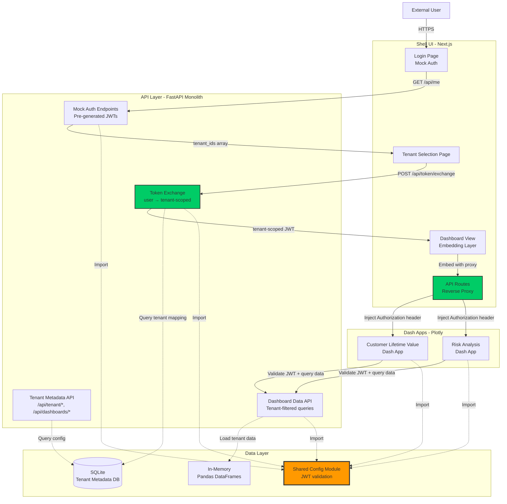

# 2. High Level Architecture

## 2.1 Technical Summary

The Kyros SaaS PoC implements a **multi-tenant web application architecture** with hard tenant isolation enforced through JWT token exchange. The system uses a **Next.js Shell UI** as the authenticated entry point, a **FastAPI monolith** for token exchange and tenant-scoped data access, and **embedded Plotly Dash applications** for data visualization. The architecture validates the production pattern through **reverse proxy header injection** where tenant-scoped JWTs are passed to Dash apps without client-side exposure.

The PoC runs entirely **locally** using Docker Compose, with mock authentication, SQLite for tenant metadata, and in-memory Pandas DataFrames for dashboard data. The token exchange mechanism—converting a user access token (with multiple `tenant_ids`) into a short-lived tenant-scoped token (single `tenant_id`)—is the central architectural validation point. A **shared configuration module** ensures JWT validation consistency across FastAPI and Dash services, addressing the configuration drift risk identified in brainstorming.

This architecture achieves the PRD's core goal: **prove that tenant isolation works through JWT claims** while maintaining production-realistic patterns (token exchange, reverse proxy, tenant metadata resolution) that can transition directly to MVP with infrastructure substitutions.

## 2.2 Platform and Infrastructure Choice

**Platform:** Local Development (Docker Compose)
**Key Services:**
- **Next.js (v14)** - Shell UI with API routes for reverse proxy
- **FastAPI (v0.115)** - Monolith handling auth mock, token exchange, and data APIs
- **Plotly Dash (v2.18)** - Two sample dashboard applications
- **SQLite** - Tenant metadata database
- **Python** - Pandas DataFrames for in-memory tenant data

**Deployment Host and Regions:** Local development environment only (no cloud deployment for PoC)

**Rationale:** The brainstorming session emphasized "architectural fidelity with pragmatic mocking." Docker Compose provides consistent local execution while avoiding cloud infrastructure costs and complexity. This choice allows rapid iteration on the token exchange mechanism—the core validation target—without dealing with cloud IAM, networking, or deployment pipelines.

**Production Path:** The MVP will migrate to **Azure** (Azure AD B2C, Azure Database for PostgreSQL, Azure Storage, App Service/AKS) as documented in existing architecture, but the PoC proves the patterns work before incurring infrastructure costs.

## 2.3 Repository Structure

**Structure:** Monorepo
**Monorepo Tool:** npm workspaces (lightweight, no additional tooling required)
**Package Organization:**

```
kyros-saas-poc/
├── apps/
│   ├── shell-ui/          # Next.js frontend
│   ├── api/               # FastAPI monolith
│   ├── dash-app-clv/      # Customer Lifetime Value dashboard
│   └── dash-app-risk/     # Risk Analysis dashboard
├── packages/
│   └── shared-config/     # Shared JWT config, constants, types
├── data/
│   └── mock-data/         # CSV/Parquet files for in-memory loading
├── docs/                  # Architecture, PRD, brainstorming results
└── docker-compose.yml     # Orchestration
```

**Rationale:**
- **Monorepo** enables sharing the critical configuration module between FastAPI and Dash apps (solves the "root cause" from Five Whys analysis)
- **npm workspaces** is sufficient for this PoC scale without Nx/Turborepo complexity
- **Separate Dash apps** demonstrate multi-dashboard capability and token passing to different embedded applications
- **Shared config package** is the lynchpin—ensures JWT secret, algorithm, and validation logic are identical across all services

## 2.4 High Level Architecture Diagram



## 2.5 Architectural Patterns

- **Token Exchange Pattern:** User authentication returns multi-tenant access token; explicit tenant selection triggers exchange to short-lived, single-tenant token - _Rationale:_ Enforces hard tenant isolation by ensuring embedded apps can only access one tenant's data per session; prevents confused deputy attacks

- **Backend For Frontend (BFF) via Next.js API Routes:** Shell UI uses Next.js API routes as reverse proxy with header injection - _Rationale:_ Keeps tenant-scoped JWT in server-side context (never exposed to browser), enables header injection for Dash embedding, validates production-realistic pattern

- **Shared Configuration Module:** Python package with JWT validation settings imported by all services - _Rationale:_ Solves root cause identified in Five Whys (configuration inconsistency); prevents signature validation failures from mismatched secrets/algorithms

- **Mock-Driven Development:** Mock external dependencies (auth, cloud storage, observability) while keeping internal patterns production-realistic - _Rationale:_ Focuses validation on architectural mechanisms (token exchange, tenant isolation) rather than infrastructure integration

- **Deny-by-Default Tenancy:** Every API request validates tenant_id from JWT claims; client never supplies tenant context - _Rationale:_ Security-first design prevents tenant enumeration and unauthorized cross-tenant access

- **Repository Pattern (Data Access Layer):** FastAPI DAL maps (tenant_id, dashboard_slug) to safe data queries - _Rationale:_ Centralizes tenant-scoped data access logic, makes it easy to swap in-memory sources for Azure Storage in MVP

---
