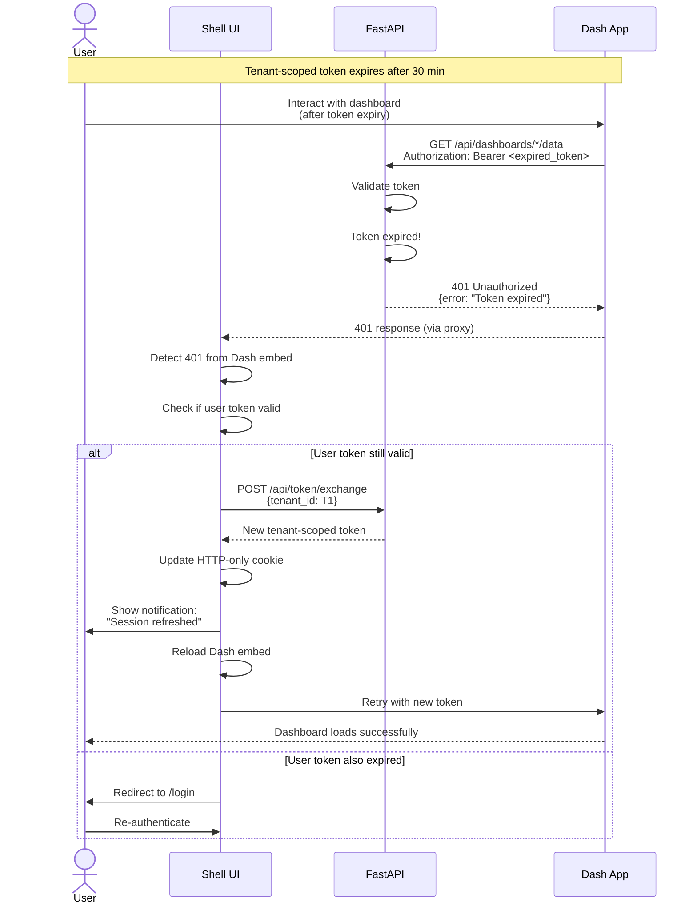
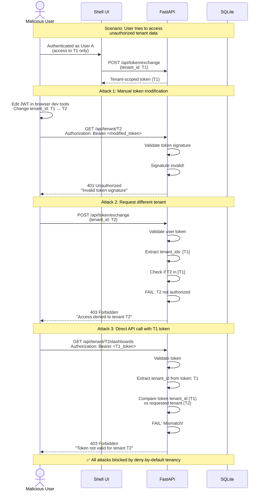

# 7. Core Workflows

This section illustrates key user journeys and system interactions using sequence diagrams, focusing on the critical validation points identified in the brainstorming session.

## 7.1 Complete Authentication and Dashboard Access Flow

```mermaid
sequenceDiagram
    actor User
    participant Shell as Shell UI<br/>(Next.js)
    participant API as FastAPI<br/>Monolith
    participant DB as SQLite<br/>Metadata
    participant Dash as Dash App<br/>(CLV/Risk)
    participant Data as In-Memory<br/>Data Store

    Note over User,Data: 1. Mock Login
    User->>Shell: Navigate to /login
    Shell->>User: Show login form
    User->>Shell: Enter email
    Shell->>API: POST /api/auth/mock-login<br/>{email}
    API->>API: Lookup user in mock data
    API->>API: Generate user access token<br/>(tenant_ids: [T1, T2])
    API-->>Shell: {access_token, expires_in}
    Shell->>Shell: Store token in memory/cookie

    Note over User,Data: 2. Tenant Discovery
    Shell->>API: GET /api/me<br/>Authorization: Bearer <user_token>
    API->>API: Validate user token
    API->>DB: SELECT user_tenants<br/>WHERE user_id = sub
    DB-->>API: [{T1, "viewer"}, {T2, "admin"}]
    API->>DB: SELECT tenants<br/>WHERE id IN (T1, T2)
    DB-->>API: Tenant metadata
    API-->>Shell: {user_id, email, tenants: [...]}

    Note over User,Data: 3. Tenant Selection
    Shell->>User: Show tenant selector<br/>(Acme Corp, Beta Inc)
    User->>Shell: Select "Acme Corp" (T1)

    Note over User,Data: 4. Token Exchange
    Shell->>API: POST /api/token/exchange<br/>Authorization: Bearer <user_token><br/>{tenant_id: T1}
    API->>API: Validate user token
    API->>API: Extract tenant_ids from token
    API->>API: Verify T1 in tenant_ids
    API->>DB: SELECT user_tenants<br/>WHERE user_id=sub AND tenant_id=T1
    DB-->>API: {role: "viewer"}
    API->>API: Generate tenant-scoped token<br/>(tenant_id: T1, role: "viewer")<br/>Expiry: 30 min
    API-->>Shell: {access_token, expires_in: 1800}
    Shell->>Shell: Store tenant token in<br/>HTTP-only cookie

    Note over User,Data: 5. Dashboard Listing
    Shell->>API: GET /api/tenant/T1/dashboards<br/>Authorization: Bearer <tenant_token>
    API->>API: Validate tenant token
    API->>API: Extract tenant_id from token
    API->>API: Verify token tenant_id == T1
    API->>DB: SELECT td.slug, d.title, d.description<br/>FROM tenant_dashboards td<br/>JOIN dashboards d ON td.slug = d.slug<br/>WHERE td.tenant_id = T1
    DB-->>API: [{slug: "clv", title: "CLV"}, ...]
    API-->>Shell: Dashboard list
    Shell->>User: Show dashboard tiles

    Note over User,Data: 6. Dashboard Embedding
    User->>Shell: Click "Customer Lifetime Value"
    Shell->>Shell: Navigate to<br/>/tenant/acme-corp/dashboard/clv
    Shell->>User: Render page with iframe/embed
    User->>Shell: Browser loads embedded Dash app
    Shell->>Shell: API Route: /api/proxy/dash/clv
    Shell->>Shell: Inject Authorization header<br/>from HTTP-only cookie
    Shell->>Dash: GET /dash/clv/<br/>Authorization: Bearer <tenant_token>

    Note over User,Data: 7. Dash App Initialization
    Dash->>Dash: Validate tenant token<br/>(shared config module)
    Dash->>Dash: Extract tenant_id: T1
    Dash->>API: GET /api/dashboards/clv/data<br/>Authorization: Bearer <tenant_token>
    API->>API: Validate tenant token
    API->>API: Extract tenant_id from token
    API->>Data: load_tenant_data(T1, "clv")
    Data-->>API: Pandas DataFrame (T1 data only)
    API-->>Dash: {tenant_id: T1, data: [...]}
    Dash->>Dash: Render visualizations
    Dash-->>Shell: HTML response
    Shell-->>User: Display dashboard

    Note over User,Data: 8. User Interaction (Filter)
    User->>Dash: Change filter (e.g., date range)
    Dash->>API: GET /api/dashboards/clv/data?filters=...<br/>Authorization: Bearer <tenant_token>
    API->>API: Validate tenant token
    API->>Data: load_tenant_data(T1, "clv")<br/>+ apply filters
    Data-->>API: Filtered DataFrame
    API-->>Dash: {tenant_id: T1, data: [...]}
    Dash->>Dash: Update visualization
    Dash-->>User: Refreshed chart
```

## 7.2 Token Expiry and Refresh Flow

## 7.3 Cross-Tenant Isolation Validation

---
